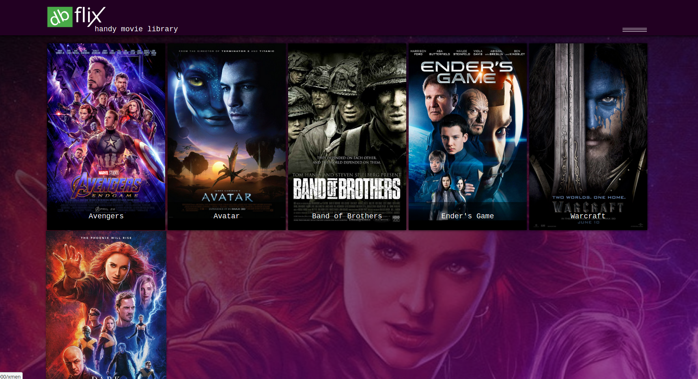

# dbFlix (kodflix) – React + Express + MongoDB

dbFlix is a small full‑stack demo app:

- **Frontend**: React (Create React App) running on `localhost:3000`
- **Backend**: Express API running on `localhost:3002`
- **Database**: MongoDB (default `mongodb://localhost:27017/`, database name `dbflix`)

The UI loads movies by calling **`/rest/movies`** from the frontend. In development, CRA proxies that request to the backend (see `"proxy"` in `package.json`). The backend then reads from the MongoDB **`movies`** collection and returns JSON.

## Data flow

- **Browser → React**: user opens the gallery/details pages
- **React → Express**: `GET /rest/movies` (and optionally `GET /rest/movies/:id`)
- **Express → MongoDB**: queries the `dbflix.movies` collection
- **MongoDB → Express → React**: movie documents are returned and rendered

## Requirements

- Node.js (you’re using Node 18+; CRA 3 needs `NODE_OPTIONS=--openssl-legacy-provider` which is already wired into the start scripts)
- MongoDB running locally (or provide a connection string)

## Quick start (dev)

Install dependencies:

```bash
npm ci --ignore-scripts
```

Start MongoDB locally (however you prefer) and seed sample movie data:

```bash
npm run seed
```

Start the backend:

```bash
npm run _start-backend
```

Start the frontend:

```bash
npm run _start-frontend
```

Open `http://localhost:3000`.

## MongoDB connection config

The backend uses these env vars (first one wins):

- `MONGO_URL` or `MONGODB_URI`: MongoDB connection string (defaults to `mongodb://localhost:27017/`)
- `MONGO_DB`: database name (defaults to `dbflix`)

Example:

```bash
MONGO_URL="mongodb://localhost:27017/" MONGO_DB="dbflix" npm run _start-backend
```

## API

- `GET /rest/movies`: returns all movies from MongoDB
- `GET /rest/movies/:id`: returns one movie by `id`

## Screenshot




<!-- 
## Dev environment: 

### `yarn` command in the project folder
Resolving packages

### `yarn start-dev` command in project folder
Runs the app in the development mode.<br />
(Local response from NodeJs, no MongoBD integration)<br />

[http://localhost:3000](http://localhost:3000) to view it in the browser.
-->
